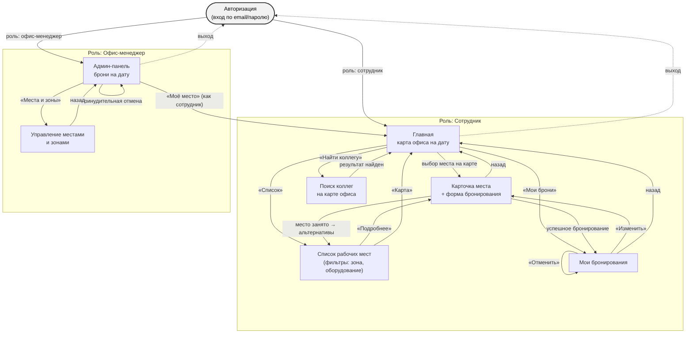
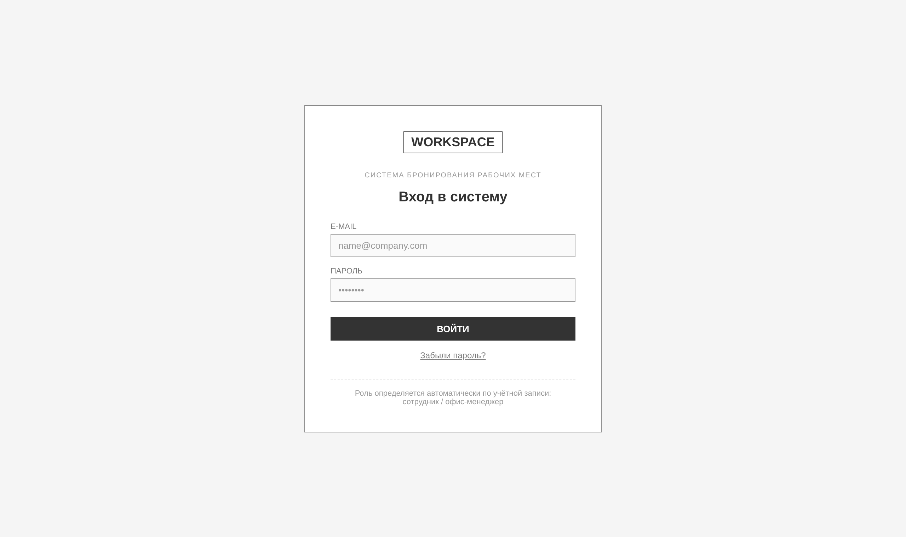
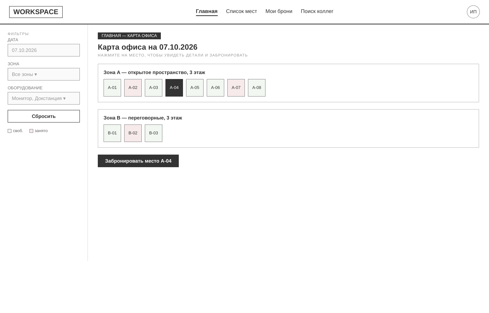
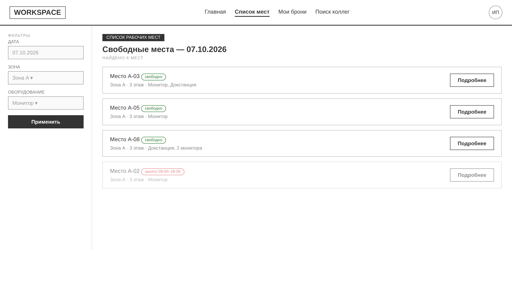
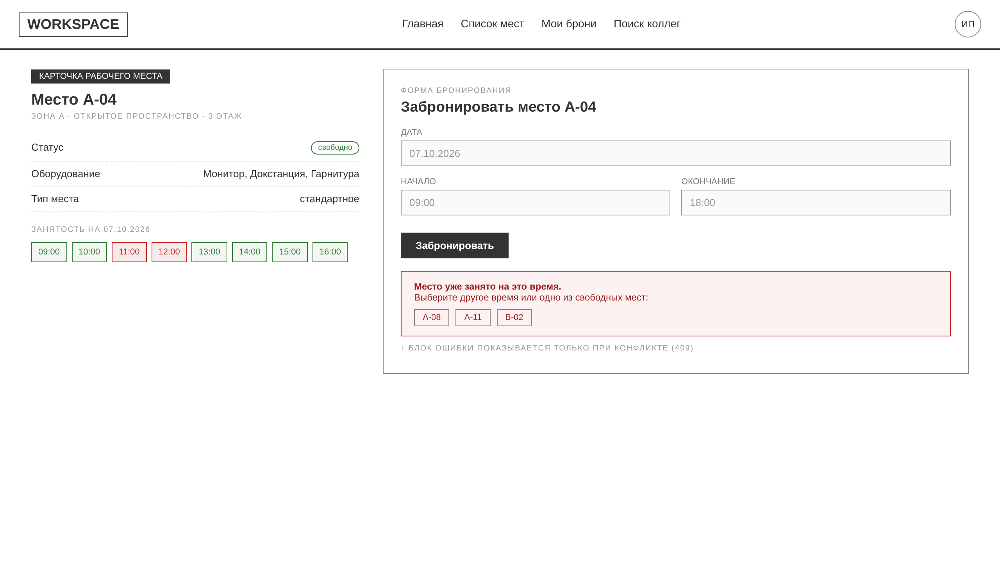
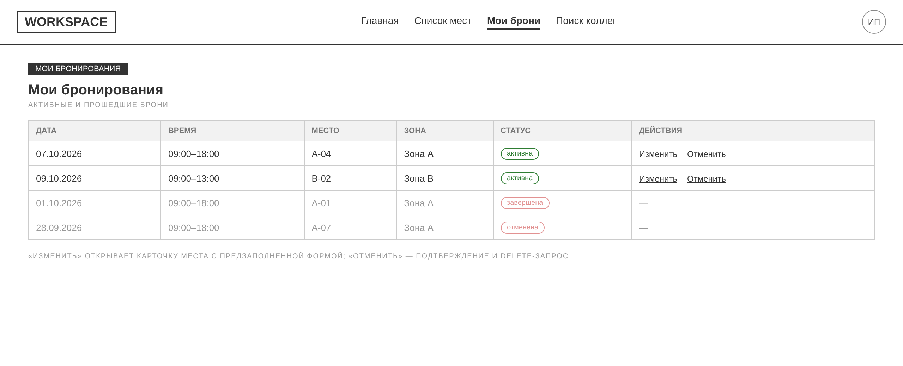
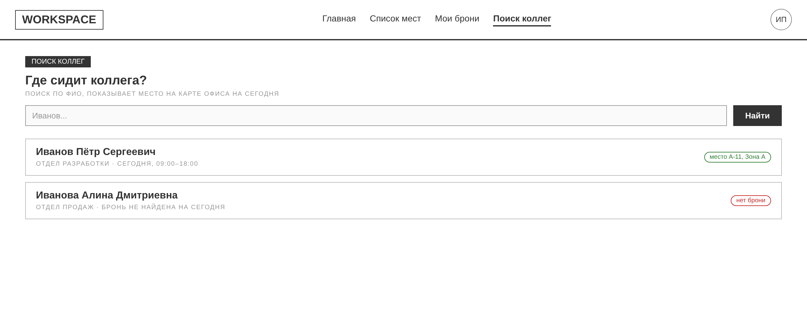
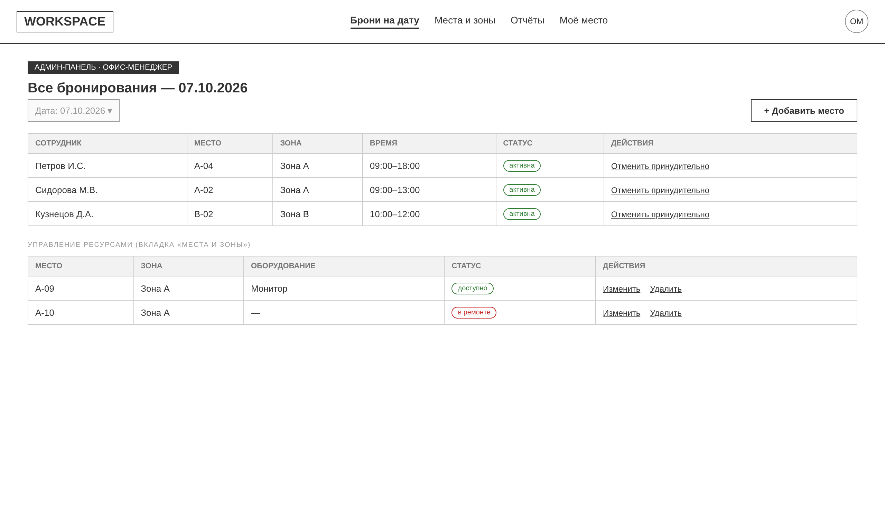

# Лабораторная работа №4
## Проектирование пользовательского интерфейса

**Модуль:** Архитектура современных информационных систем
**Тема:** Архитектура веб-систем: клиент, сервер и API
**Предметная область:** система бронирования рабочих мест в офисе (продолжение лаб №1–3)

## Цель работы

Изучить основные принципы проектирования пользовательских интерфейсов, разработать структуру экранов информационной системы, спроектировать навигацию и подготовить макеты основных страниц.

## Краткое описание задания

На основе архитектуры и API, спроектированных в лабораторной работе №3 ([`lab3`](https://github.com/Monetka3110/lab3)), для системы бронирования рабочих мест разработан пользовательский интерфейс: определён перечень экранов, спроектирована навигация между ними с учётом двух ролей пользователей (сотрудник и офис-менеджер), подготовлены wireframe-прототипы основных страниц.

---

## 1. Структура пользовательского интерфейса

Всего спроектировано **7 экранов** — по одному для каждого основного пользовательского сценария из FR-01…FR-09 (лаба №1) и всех эндпоинтов REST API (лаба №3).

| № | Экран | Назначение | Основные элементы | Доступные действия |
|---|---|---|---|---|
| 1 | **Авторизация** | Вход в систему, определение роли пользователя | Шапка/лого, поля email и пароль, кнопка входа | Войти, восстановить пароль |
| 2 | **Главная (карта офиса)** | Обзор занятости офиса на выбранную дату, точка входа во все сценарии сотрудника | Шапка с меню, панель фильтров (дата, зона, оборудование), интерактивная карта мест по зонам | Выбрать дату/зону/оборудование, выбрать место на карте, перейти к бронированию |
| 3 | **Список рабочих мест** | Альтернативное представление карты офиса — списком, с фильтрами | Панель фильтров, карточки мест (номер, зона, оборудование, статус) | Отфильтровать, открыть карточку места |
| 4 | **Карточка места + форма бронирования** | Просмотр деталей места и создание брони | Информация о месте, шкала занятости по часам, форма (дата/начало/окончание), блок ошибки конфликта с альтернативами | Забронировать, выбрать альтернативное время/место |
| 5 | **Мои бронирования** | Управление собственными бронями | Таблица броней (дата, время, место, статус) | Изменить бронь, отменить бронь |
| 6 | **Поиск коллег** | Поиск сотрудника и его места на карте офиса | Поле поиска по ФИО, карточки результатов | Найти коллегу, увидеть его место на сегодня |
| 7 | **Админ-панель офис-менеджера** | Управление бронированиями, местами и зонами (роль офис-менеджер) | Таблица всех броней на дату, таблица мест/зон с оборудованием и статусом | Принудительно отменить бронь, добавить/изменить/удалить место |

Экраны 2–6 доступны роли **«Сотрудник»**, экран 7 — роли **«Офис-менеджер»** (адаптация интерфейса под роль, как того требует задание и FR-06…FR-09 из лабы №1). Общие для ролей элементы — шапка с логотипом и индикатором пользователя — сохраняют единообразие оформления; состав пунктов меню в шапке меняется в зависимости от роли.

## 2. Навигация между экранами

Схема навигации (исходник: [`diagrams/navigation.mmd`](diagrams/navigation.mmd)):



**Логика переходов:**

- После входа пользователь попадает на **Главную** (роль «Сотрудник») или в **Админ-панель** (роль «Офис-менеджер») — центральные экраны для каждой роли, откуда доступны все остальные разделы через меню шапки.
- С Главной (карта) и из Списка мест можно перейти в карточку конкретного места — это два равнозначных пути к одному экрану (FR-01).
- Из карточки места после успешного бронирования пользователь попадает в «Мои бронирования»; при конфликте (место уже занято — см. раздел 4 README лабы №3) форма показывает свободные альтернативы, не покидая экран.
- «Мои бронирования» → «Изменить» открывает ту же карточку места с предзаполненной формой — переиспользование экрана вместо отдельной формы редактирования.
- Из любого экрана роли «Сотрудник» доступен выход на Авторизацию; офис-менеджер дополнительно может переключиться в режим «Моё место», чтобы самому забронировать стол.
- Навигация выстроена вокруг одного центрального экрана на роль, с понятным путём «назад» в шапке — в соответствии с рекомендациями по UX из теоретической части задания.

## 3. Прототипы экранов (wireframes)

Low-fidelity прототипы подготовлены в виде HTML/CSS-макетов (исходники: [`wireframes-src/`](wireframes-src/)) и экспортированы в PNG (папка [`images/`](images/)). На этом этапе важна структура и логика расположения блоков, а не визуальный стиль.

### 3.1 Авторизация

Простая форма входа. Роль (сотрудник / офис-менеджер) определяется на сервере по учётной записи — отдельного переключателя на экране нет.

### 3.2 Главная — карта офиса

Центральный экран сотрудника. Слева — фильтры (дата, зона, оборудование), справа — карта офиса по зонам: каждое место окрашено по статусу (свободно/занято), выбранное место подсвечено и ведёт к бронированию.

### 3.3 Список рабочих мест

Альтернатива карте для пользователей, которым удобнее список. Те же фильтры, результат — карточки мест с кнопкой «Подробнее».

### 3.4 Карточка места и форма бронирования

Ключевой экран, реализующий нетиповую особенность предметной области (лаба №3, раздел 4) — проверку занятости «на лету»: шкала занятости по часам слева и блок ошибки 409 с готовыми альтернативами справа, если место заняли параллельно.

### 3.5 Мои бронирования

Таблица активных и прошедших броней с действиями «Изменить» / «Отменить» для активных записей.

### 3.6 Поиск коллег

Реализует FR-05: поиск сотрудника по ФИО и отображение его текущего места на сегодня.

### 3.7 Админ-панель офис-менеджера

Реализует FR-06…FR-09: список всех броней на дату с принудительной отменой и управление местами/зонами (добавление, редактирование, статус).

## 4. Принятые решения по организации интерфейса

- **Единый каркас (шапка + меню + аватар)** на всех экранах — для единообразия оформления и предсказуемой навигации.
- **Два независимых представления одного и того же набора мест** (карта и список) — карта нагляднее показывает расположение и соседей, список удобнее для быстрого сравнения по фильтрам; оба ведут в одну карточку места, что экономит разработку.
- **Один экран на просмотр и бронирование** (карточка места), а не отдельный визард — минимизирует количество шагов пользователя в соответствии с рекомендацией «минимальное количество действий для выполнения основных операций».
- **Явный блок ошибки с альтернативами** на карточке места — прямое отражение серверной логики `AvailabilityService` (409 Conflict + alternatives) в интерфейсе, чтобы конфликт бронирования не был тупиком для пользователя.
- **Разделение интерфейсов по ролям** на уровне пунктов меню и набора экранов — сотрудник не видит административных функций, офис-менеджер работает в отдельном разделе, но может переключиться в режим обычного пользователя.
- **Low-fidelity wireframe** вместо детального дизайна — на этом этапе важна структура экранов и логика переходов; визуальный стиль (цвета, шрифты, иконки) будет проработан на следующих этапах.

## Вывод

В ходе работы на основе архитектуры и API системы бронирования рабочих мест (лаба №3) спроектирован пользовательский интерфейс: определены 7 экранов с их назначением, элементами и доступными действиями, построена схема навигации с учётом двух ролей пользователей, подготовлены wireframe-прототипы всех основных страниц. Интерфейс отражает ключевую особенность системы — проверку занятости места «на лету» — через отдельный блок конфликта с предложением альтернатив. Результаты являются основой для разработки frontend-части приложения и дальнейшей проработки визуального дизайна (mockup) в следующих лабораторных работах.

---

## Домашняя доработка

- доработать схему навигации (добавить обработку ошибок авторизации, пустые состояния);
- добавить описание API непосредственно в этот отчёт (ссылка на [`../lab3/src/docs/api.md`](https://github.com/Monetka3110/lab3/blob/main/src/docs/api.md));
- подготовить проект к следующей лабораторной работе (переход от wireframe к mockup / верстке).

## Структура репозитория

```
lab4/
├── README.md                     # этот файл
├── diagrams/
│   └── navigation.mmd             # исходник схемы навигации (Mermaid)
├── images/
│   ├── navigation.png             # рендер схемы навигации
│   └── screen-0N-*.png            # скриншоты прототипов экранов
├── wireframes-src/                # исходники прототипов (HTML/CSS) и скрипт рендера
└── design/                        # зарезервировано под файлы Figma/Penpot при переходе к mockup
```

## Используемое ПО

- Git / GitHub — хранение результатов;
- Mermaid — построение схемы навигации;
- HTML/CSS + Playwright (headless Chromium) — построение и экспорт wireframe-прототипов в PNG (замена специализированного редактора интерфейсов для учебных целей);
- Visual Studio Code — редактирование Markdown.
